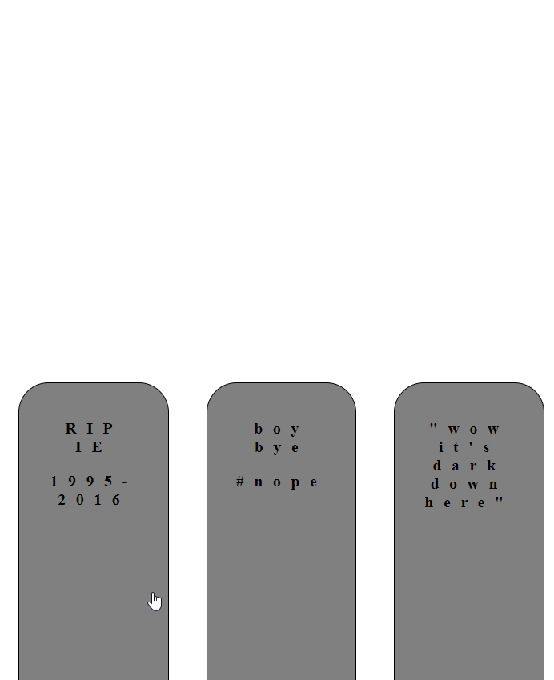

# Graveyard component

For JS Study Night October 2017.

</img>

### Examples
- [hamburger buttons](http://kcmr.github.io/transburger-icon/components/transburger-icon/demo/)

### Resources
- [webcomponents.github.io] (http://webcomponents.github.io/)
- [Google](https://developers.google.com/web/fundamentals/web-components/customelements)
- [CSS Tricks](https://css-tricks.com/modular-future-web-components/)
- [MDN](https://developer.mozilla.org/en-US/docs/Web/Web_Components/Custom_Elements)
- [Tutorial by Trent Willis](https://pretty-okay.com/2017/10/14/intro-web-components.html)

### Steps
1. Creating an html template
    - adding CSS
2. Creating the JS custom element 
3. Using the custom element
4. Publishing to NPM for a CDN
